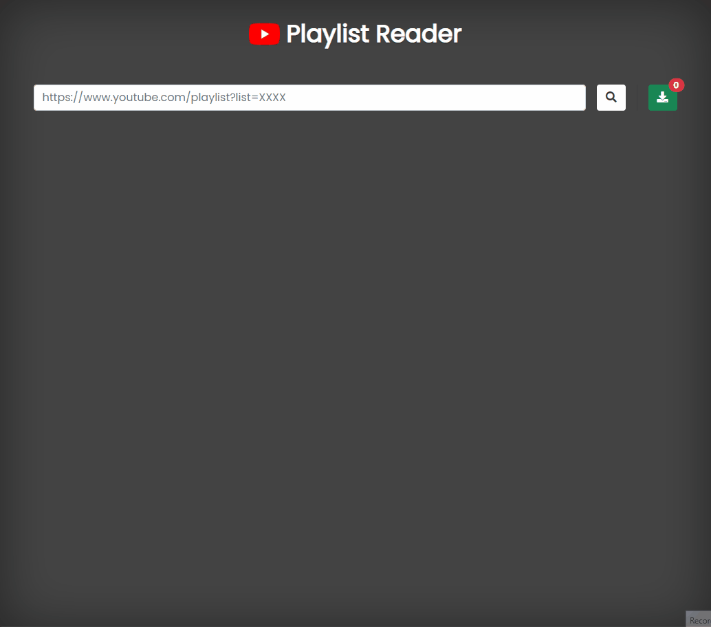

<div align="center">
  <h1 align="center">PLAYLIST READER</h1>
</div>

<details open="open">
  <summary>Table of Contents</summary>
  <ol>
    <li><a href="#about">About</a></li>
    <li><a href="#usage">Usage</a></li>
    <li><a href="#installation">Installation</a></li>
    <li><a href="#contributing">Contributing</a></li>
    <li><a href="#license">License</a></li>
  </ol>
</details>

## About


>  Tool in python to get data from a youtube playlist

#### Motivation
When I created a music playlist on youtube over time some videos were deleted or hidden by the owner and unfortunately youtube doesn't show exactly which videos are gone. So the idea of this project is to make a playlist search engine to save the video titles in a file so that it can be compared in the future.

<!-- Quando eu criava uma playlist de música no youtube ao longo do tempo alguns vídeos eram excluídos ou ocultos pelo próprio dono e, infelizmente, o youtube não mostra exatamente quais vídeos sumiram. Portanto, a ideia desse projeto é fazer um mecanismo de busca de uma lista de reprodução para salvar os títulos dos vídeos em uma arquivo para que dessa maneira possa ser comparado no futuro. -->

#### Built With

- **CLI**: Python3
- **API**: Python3 with Flask
- **Front**: HTML, CSS, JS

## Usage

### API
Send HTTP GET request to:
<!-- **`http://127.0.0.1:80/playlist`** -->
[**`http://127.0.0.1:80/playlist/<playlist-link>`**](http://127.0.0.1:80)

API response example:
```json
{
  "status": 200,
  "message": "Lista dos vídeos da playlist gerado",
  "videos": [
    {
      "id": 0,
      "title": "blink-182 - Adam's Song",
      "link_img": "https://i.ytimg.com/vi/2MRdtXWcgIw/hqdefault.jpg?",
      "link_video": "https://www.youtube.com/watch?v=2MRdtXWcgIw"
    },
    {
      "id": 1,
      "title": "blink-182 - I Miss You",
      "link_img": "https://i.ytimg.com/vi/wNHGT-neTes/hqdefault.jpg?",
      "link_video": "https://www.youtube.com/watch?v=wNHGT-neTes"
    }
  ]
}
```
### Front with API
Usage: </br>
When you enter the playlist link, a list with all the songs appears and you have the possibility to download the titles.

Download file example:
#### `playlist.txt`
```
blink-182 - Adam's Song
blink-182 - I Miss You
blink-182 - Always (Official Video)
blink-182 - All The Small Things (Official Music Video)
...
```

### CLI
Usage example:
```
python3 playlist-reader.py
❯ enter playlist link: https://www.youtube.com/playlist?list=PLMKi-ss_sEoOZw9TB4iCrevTK60uY8wg0
```
Output file example:
##### `blink_182_melhores_musicas.txt`
```
blink-182 - Adam's Song
blink-182 - I Miss You
blink-182 - Always (Official Video)
blink-182 - All The Small Things (Official Music Video)
...
```
Compare different files example: </br>
```
diff -Bu playlist-file1.txt playlist-file2.txt
```

## Installation

#### 1. Install python and pip
```
sudo apt install python3 && python3-pip
```

#### 2. Clone git repository
```
git clone https://github.com/almeida-matheus/playlist-reader
```

#### 3. Install requeriments
```
pip3 install api/requeriments.txt
pip3 install cli/requeriments.txt
```

## Contributing
1. Fork the project
2. Create your branch (`git checkout -b branch-name`)
3. Add your changes (`git add .`)
4. Commit your changes (`git commit -m 'add some feature'`)
5. Push to the branch (`git push origin branch-name`)
6. Open a pull request

## License
Distributed under the MIT License. See [LICENSE](LICENSE) for more information.
